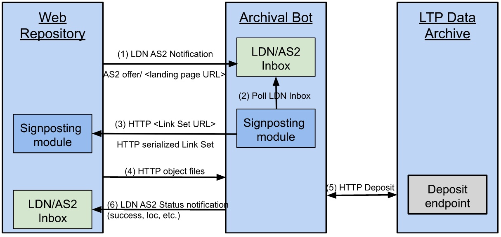

Digital Preservation Service (DPS)
========================================

!!! warning "Living Document (WIP)"

    This document is currently **under development**, which means **"Work in Progress"**.  
    Don’t cite this document other than as work in progress.  
    It is carried out in the context of the [DICE project]{target="_blank"} (Data Infrastructure Capacities for EOSC), funded by the EU's Horizon 2020 project call H2020-INFRAEOSC-2018-2020 under Grant Agreement no. 101017207.


Introduction
------------
Within the DICE project, task 4.3 created a Long Term Preservation (LTP) template and accompanying guidance that data services and repositories can use to develop their own LTP policy.
The LTP policy should clarify to the users what is or can be guaranteed by the service, for how long and by whom.
The policy template contains articles that distinguish between outsourced services and services hosted in-house.  
This file documents the functional requirements and technical specifications for a service that implements an LTP policy for B2SHARE into a CTS certified archive (outsourced), called the Digital Preservation Service (DPS).  
It is meant as a guide on how to implement an example Long-term Preservation Service between a short to midterm data (web)repository service and a long-term preservation (LTP) archive.  
The implementation adheres to documented community conventions for the use of W3C Linked Data Notifications (LDN) and Activity Streams 2 (AS2) to integrate repository systems with long-term (LTP) archives, in a distributed, resilient and web-native architecture.  
The standards used, and the application profile documented here, are implementations of the generic patterns described by [Event Notifications in Value-Adding Networks]{target=_blank}, that details a profile for using Linked Data Notifications with ActivityStreams2 payloads in value-adding networks.  
The the [COAR Notify Protocol](https://notify.coar-repositories.org/){target=_blank} is also strongly aligned with the [Event Notifications in Value-Adding Networks]{target=_blank} Profile and provides notification patterns that are more specific implementations of the generic patterns described by [Event Notifications in Value-Adding Networks]{target=_blank}.


The Digital Preservation Service
---------------------------------
## Motivation
##### asynchronous
The intended communication style among Nodes is point-to-point, requiring no centralized hubs.
Interactions among Nodes (ServiceNodes and DataNodes) are necessarily asynchronous because certain notification patterns do not require a response ("fire and forget") and, in patterns that do, such as requesting an action, the time between a request and the announcement of the Action Result is unpredictable.
Pushing any data at any moment to your archive might cause resource problems at the server side.
Therefore, it is push-oriented, with only the relevant Nodes being updated about new information as it becomes available.
##### lightweight
This proposal is lightweight. It does take relatively little resources to implement, both from the client as from the server side.
##### multi-purpose
The `LDN+AS2 notifications` approach can also be used for other purposes with the same investment. For example the peer reviewing service  [COAR Notify Protocol](https://notify.coar-repositories.org/){target=_blank}, which is also strongly aligned with the [Event Notifications in Value-Adding Networks]{target=_blank} Profile.


## Open Web Standards

As already partially covered in the introduction and the motivation, below is a list of the open web standards that will be used for the implementation of the Digital Preservation Service:

#### Linked Data Notification
W3C [Linked Data Notification](https://www.w3.org/TR/ldn/){target=_blank} (LDN) is an HTTP-based notification (push) protocol. It will be used for repository/archive communication. 
#### Activity Streams 2.0
W3C [Activity Streams 2](https://www.w3.org/TR/activitystreams-core/){target=_blank} (AS2) provides a foundational vocabulary for messaging about activities that involve web resources. A message profile will be used for LDN notifications payload exchanged by repositories and archives.  
Within this documentation, the Linked Data Notifications (LDN) with ActivityStreams2 (AS2) payloads will be reffered to as: `LDN+AS2 notifications`.
#### Signposting
[Signposting]{target=_blank} is a REST/HATEOAS “follow your nose” (navigational) approach to make the scholarly web more friendly to machines; it leverages IETF RFCs and IANA-registered link relation types. Typed links (HTTP Link header and/or HTML <link>) are used to allow machines to uniformly navigate scholarly artefacts irrespective of the repository they reside in. The FAIR Signposting Profile is a lightweight, yet powerful approach to increase the FAIRness of scholarly objects. It will be used by repositories as a means to allow archives to determine which web resources need to be retrieved in response to an on-demand archiving request.


## Namespaces
Within this document, the following namespace prefix bindings are used:

| Prefix 	 | Namespace                               | Name                                      |
|:---------|:----------------------------------------|:------------------------------------------|
| `as2`    | https://www.w3.org/ns/activitystreams#  | W3C ActivityStreams 2.0                   |
| `ldp`    | http://www.w3.org/ns/ldp#               | W3C Linked Data Platform (LDP) Vocabulary |
| `sorg`   | https://schema.org/                     | Schema.org                                |


Our examples LDN+AS2 payloads we use [JSON-LD] as syntax, in which we don’t explicitly write the prefixes.
*In the @context element in JSON-LD, one can define a mapping from the terms to [URI]-s, like done in Fig1*


## Use cases
### #1. Single record archiving
A single dataset will be transferred to a LTP-Archive on demand, according to the repository LTP Policy, by an authenticated repository dataset owner.

### #2. (Auto) Archive Community records
All records within a repository community could be auto-archived, according to a community archival agreement.  
Opt-out/in option could be offered to the dataset owner.  
This use case is a variant of use case 1 and will not be worked out in this document.

## DPS Architecture
### Components
Here we list an overview of the main components that will be in use in the DPS network.
##### Web Repository
This is the short- to midterm repository system. In the DPS this repository system is used for depositing, storing and disseminating datasets. This could be a B2SHARE instance.
##### Archival Bot
DANS implementation of the SWORD v2 protocol for automated deposits.
##### LTP Archive
Long-term Preservation Archive A proxy that authenticates clients on behalf of Dataverse, using the basic auth protocol. It is used by [dd-sword2](#dd-sword2) to authenticate its clients by
their Dataverse account credentials.


### Architecture Overview
The schema below displays all the components of the service and how they relate and interact to
each other. The notation used is not a formal one and is intended to be self-explanatory.


1. An LTP request will be sent from a Web Repository landing page to the Archival Bot’s inbox, conveying the URL of the landing page of the dataset.
2. The Archival Bot will poll the LDN Inbox for such requests.
3. The Archival bot visits the landing page URL, discovers a Link Set provided via Signposting, and retrieves it.
4. The Archival Bot parses the Link Set to obtain URLs for object files and metadata, and then retrieves those.
5. The Archival Bot deposits an archival package containing metadata and object files to the LTP-archive.
6. The Archival Bot reports back on the status of the deposit.


## Activity Diagram Use Case #1
Below a possible interaction / activity diagram is given for this use case. The numbers in the diagram corresponds to the nummers given in the description.
[![](https://mermaid.ink/img/pako:eNqtVW1r2zAQ_iuHRkgHHaPd1nZmFPK6Fkwb8tJ98RfFvjhaHcmT5dIu5L_v5JdGdlLYYPGXWM9z95zuJD9bFqoImcc6na2Qwniw7WYY5lqYFx-fMOl60E2UyrB7Cl2zxg12ve6SF-8BKxYeuBZ8mWAWMAoP2IYL2X-M6S1g7_qf--PhVcAsm4dG6VdkNByfjQcuonSEugQvvl6O--cOOMdnM1CJqvDz3qfLL5clLpXBFjy-ss8eJtE3gldKmpn4jbb2gJ1dpM8B2-12nU4gM_yVowxxKHis-SaQQD-eGyXzzZIKLd6rVVsi8ESECDyDXm7WqiKkXBsRipRLAxpTZfEfuIQp_c8Ehb0c8pbKFGl0uBZPPIG-MockXqCFnj-fwJAbXkVgIKuybEEfrq-trge-ioUEJSHhMhIyTnmMx3hTu-_MwIq2RJlLioWIQZV5MEMZwYk_vHtP4ufe_WqFGqjNYiVCbgQpfPP3ErCY-teNJKXMDA1khps8s523W9CVcIpFcMDKKJUaGHAaRFKXVq4fVt5kNTfQ3oStfCEjdYDWTciovjfqquouQ2mx7jddlBSoLyDkUj3vM5NgLTtRSdKmFBlavMEaw0eg4YuIriKoVRH02u7G4UsMPPT82yEUkAe9MMTUtMl7gbr_jSmWQW90Y5FG3GBrXHSYUq1ijVlWj6qtcTMn3s2oN4STmYglnXhDDXzfUqn37Av5WBwLX5XnyN3lQdrvo_k-4kj6TsfefNAiXhvbv0Lihv9NNrX8iaHJjmUtA6u7V8VO7mfzj5PFvLiDTvyhVLvnUqqcjuyR23G049X1jmy7q6OTZAi3d43xT9Gq_-P4y6D_cxnYKdugJhuIyFi2FqicovzIWvegj6-z3nKQcuqOj4BrJDXsuAm4dtLEa08B11QaFNc6wHWHmtX2F3ANxiU5LnM00TGvsdgukDvqWV6MfBRZU2DeitNoT5n1m9mLDJlndI41qbKkirX7A_bDcPQ?type=png)](https://mermaid.live/edit#pako:eNqtVW1r2zAQ_iuHRkgHHaPd1nZmFPK6Fkwb8tJ98RfFvjhaHcmT5dIu5L_v5JdGdlLYYPGXWM9z95zuJD9bFqoImcc6na2Qwniw7WYY5lqYFx-fMOl60E2UyrB7Cl2zxg12ve6SF-8BKxYeuBZ8mWAWMAoP2IYL2X-M6S1g7_qf--PhVcAsm4dG6VdkNByfjQcuonSEugQvvl6O--cOOMdnM1CJqvDz3qfLL5clLpXBFjy-ss8eJtE3gldKmpn4jbb2gJ1dpM8B2-12nU4gM_yVowxxKHis-SaQQD-eGyXzzZIKLd6rVVsi8ESECDyDXm7WqiKkXBsRipRLAxpTZfEfuIQp_c8Ehb0c8pbKFGl0uBZPPIG-MockXqCFnj-fwJAbXkVgIKuybEEfrq-trge-ioUEJSHhMhIyTnmMx3hTu-_MwIq2RJlLioWIQZV5MEMZwYk_vHtP4ufe_WqFGqjNYiVCbgQpfPP3ErCY-teNJKXMDA1khps8s523W9CVcIpFcMDKKJUaGHAaRFKXVq4fVt5kNTfQ3oStfCEjdYDWTciovjfqquouQ2mx7jddlBSoLyDkUj3vM5NgLTtRSdKmFBlavMEaw0eg4YuIriKoVRH02u7G4UsMPPT82yEUkAe9MMTUtMl7gbr_jSmWQW90Y5FG3GBrXHSYUq1ijVlWj6qtcTMn3s2oN4STmYglnXhDDXzfUqn37Av5WBwLX5XnyN3lQdrvo_k-4kj6TsfefNAiXhvbv0Lihv9NNrX8iaHJjmUtA6u7V8VO7mfzj5PFvLiDTvyhVLvnUqqcjuyR23G049X1jmy7q6OTZAi3d43xT9Gq_-P4y6D_cxnYKdugJhuIyFi2FqicovzIWvegj6-z3nKQcuqOj4BrJDXsuAm4dtLEa08B11QaFNc6wHWHmtX2F3ANxiU5LnM00TGvsdgukDvqWV6MfBRZU2DeitNoT5n1m9mLDJlndI41qbKkirX7A_bDcPQ)

## LDN Payloads

The LDN payloads that are involved in the activity diagram above, have been composed of the specifications in both Event Notifications and COAR Notify.  
It highly recommended to take notice of these specifications for a better understanding of the backgrounds.  


1. The <b>Author</b> logs in into the landingpage of the dataset that it owns on the **Web Repository** (authorized user).
2. The authorized <b>Author</b> presses an archival-button, to start a Long Term Preservation (LTP) request for this dataset on the landingpage.
3. The **Web Repository** (Data Node) sends a Linked Data Notification (LDN) Offer`as2:Offer`to the LDN inbox`ldp:inbox`of the **Archival Bot** (Service Node). The payload MUST hold the landingpage URL `sorg:AboutPage` of the scholary object/dataset. This is by convention in both Event Notifications and COAR Notify. Also, providing the PID as a `ietf:cite-as` relation, together with the landing page URL is mandated by both specifications. This way all the associated resources can be found and retrieved by using FAIR Signposting discovery methods (12).

*Example JSON-LD as2:Offer payload (3)*:

```json
{
    "@context": [
        "https://www.w3.org/ns/activitystreams",
        "https://purl.org/coar/notify"
    ],
    "id": "urn:uuid:6E5FAF88-A7F1-47A4-B087-77345EBFF495",
    "type": "Offer",
    "actor": {
        "id": "https://orcid.org/0000-0003-4405-7546",
        "name": "Authorized User",
        "type": "Person"
    },
    "origin": {
        "id": "https://b2share.eudat.eu",
        "name": "EUDAT B2SHARE Web Repository",
        "inbox": "https://b2share.eudat.eu/inbox/",
        "type": "Service"
    },
    "object": {
        "id": "https://b2share.eudat.eu/records/1c42a67a73e9424b8192ba65c81077e1",
        "ietf:cite-as": "https://doi.org/10.23728/b2share.1c42a67a73e9424b8192ba65c81077e1",
        "type": [
            "sorg:AboutPage",
            "sorg:Dataset"
        ]
    },
    "target": {
        "id": "https://data.archive.xyz.net/",
        "inbox": "https://archivebot.data-stations.nl/inbox/",
        "name": "DANS Archival Bot",
        "type": "Service"
    }
}
```

<ol start="4">
	<li>The <b>Web Repository</b> flags the status on the landingpage of the scholary object/dataset to &quot;LTP Request Pending&quot;.   
	<li>Option: The <b>Author</b> cancels the LTP request, by pressing the "Cancel LTP" button on the landing page.
	<li>Option: In response to action (5), the <b>Web Repository</b> sends a Linked Data Notification (LDN) Undo<code>as2:Undo</code> to the LDN inbox<code>ldp:inbox</code>of the <b>Archival Bot</b> (Service Node).
	<li>Option: In response to action (5), the <b>Web Repository</b> cleares the LTP status/flag on the landingpage, on behalf of the <b>Author</b>.
</ol>

*Example JSON-LD as2:Undo payload (6)*:

```json
{
    "@context": [
        "https://www.w3.org/ns/activitystreams",
        "https://purl.org/coar/notify"
    ],
    "id": "urn:uuid:70892B92-001E-40C8-B4E8-B70BBC334419",
    "type": "Undo",
    "actor": {
        "id": "https://acme.org/profile/card#us",
        "inbox": "https://acme.org/inbox/",
        "name": "ACME Research Institute",
        "type": "Organization"
    },
    "origin": {
        "id": "https://b2share.eudat.eu",
        "name": "EUDAT B2SHARE Repository System",
        "type": "Service"
    },
    "object": {
        "id": "urn:uuid:6E5FAF88-A7F1-47A4-B087-77345EBFF495",
        "type": "Offer",
        "actor": {
            "id": "https://acme.org/profile/card#us",
            "inbox": "https://acme.org/inbox/",
            "name": "ACME Research Institute",
            "type": "Organization"
        },
        "origin": {
            "id": "https://b2share.eudat.eu",
            "name": "EUDAT B2SHARE Repository System",
            "type": "Service"
        },
        "object": {
            "id": "https://b2share.eudat.eu/records/1c42a67a73e9424b8192ba65c81077e1",
            "type": [
                "sorg:AboutPage",
                "sorg:Dataset"
            ]
        },
        "target": {
            "id": "https://archivebot.data-stations.nl/",
            "inbox": "https://archivebot.data-stations.nl/inbox/",
            "name": "DANS Archival Bot",
            "type": "Service"
        }
    },
    "target": {
        "id": "https://archivebot.data-stations.nl/",
        "inbox": "https://archivebot.data-stations.nl/inbox/",
        "name": "DANS Archival Bot",
        "type": "Service"
    }
}
```

<ol start="8">
	<li>The <code>as2:Offer</code>in the LDN<code>ldp:inbox</code>of the <b>LTP Data Archive</b> is picked up by the <b>Archival Bot</b>  
	<li>The <b>Archival Bot</b> checks the validity of the <code>as2:Offer</code>. It checks against known rules, like registered domain, RDF format/SHACL validation, etc. It will either accept(10) or reject(19) the<code>as2:Offer</code>   
	<li>The <b>Archival Bot</b> sends an<code>as2:Accept</code>notification to the LDN<code>ldp:inbox</code>of the <b>Web Repository</b>.
</ol>  

*Example JSON-LD as2:Accept payload (10)*:

```json
{
    "@context": [
        "https://www.w3.org/ns/activitystreams",
        "https://purl.org/coar/notify"
    ],
    "id": "urn:uuid:9C0ED771-B7F3-4A50-8A92-72DF63215BCB",
    "type": "Accept",
    "actor": {
        "id": "https://archivebot.data-stations.nl/",
        "inbox": "https://archivebot.data-stations.nl/inbox/",
        "name": "DANS Archival Bot",
        "type": "Service"
    },
    "origin": {
        "id": "https://data.archive.xyz.net/system",
        "name": "XYZ Archiving Department",
        "type": "Application"
    },
    "inReplyTo": "urn:uuid:6E5FAF88-A7F1-47A4-B087-77345EBFF495",
    "context": "https://b2share.eudat.eu/records/1c42a67a73e9424b8192ba65c81077e1",
    "object": {
        "id": "urn:uuid:6E5FAF88-A7F1-47A4-B087-77345EBFF495",
        "type": "Offer",
        "actor": {
            "id": "https://acme.org/profile/card#us",
            "inbox": "https://acme.org/inbox/",
            "name": "ACME Research Institute",
            "type": "Organization"
        },
        "origin": {
            "id": "https://b2share.eudat.eu",
            "name": "EUDAT B2SHARE Repository System",
            "type": "Service"
        },
        "object": {
            "id": "https://b2share.eudat.eu/records/1c42a67a73e9424b8192ba65c81077e1",
            "type": [
                "sorg:AboutPage",
                "sorg:Dataset"
            ]
        },
        "target": {
            "id": "https://archivebot.data-stations.nl/",
            "inbox": "https://archivebot.data-stations.nl/inbox/",
            "name": "DANS Archival Bot",
            "type": "Service"
        }
    },
    "target": {
        "id": "https://acme.org/profile/card#us",
        "inbox": "https://acme.org/inbox/",
        "name": "ACME Research Institute",
        "type": "Organization"
    }
}
```
<ol start="11">
	<li>The <b>Web Repository</b> updates the status of the landingpage from &quot;Request Pending&quot; to &quot;Long Term Archiving in progress&quot;.    
	<li>The <b>Archival Bot</b> will retrieve the Link Set URL from the <b>Web Repository</b> landing page, by either HTTP header or HTML <head> of the landingpage URL, as is described by Signposting.  
	<li>The Link Set location is returned by the <b>Web Repository</b>.  
	<li>The <b>Archival Bot</b> retrieves the seriailized Link Set from the <b>Web Repository</b>.  
	<li>The <b>Archival Bot</b> retrieves the content resources from the <b>Web Repository</b> that are listed in the Link Set.    
	<li>The <b>Archival Bot</b> prepares and sends all content resources to the the <b>LTP Data Archive</b>.  
	<li><b>Archival Bot</b> sends an <code>as2:Announce</code> notification to the LDN<code>ldp:inbox</code>of the <b>Web Repository</b>.
</ol>

*Example JSON-LD as2:Announce payload (17)*:

```json
{
    "@context": [
        "https://www.w3.org/ns/activitystreams",
        "https://purl.org/coar/notify"
    ],
    "id": "urn:uuid:ED0E06DA-4294-43C0-8E87-800558E4045B",
    "type": "Announce",
    "actor": {
        "id": "https://archivebot.data-stations.nl/",
        "inbox": "https://archivebot.data-stations.nl/inbox/",
        "name": "DANS Archival Bot",
        "type": "Service"
    },
    "origin": {
        "id": "https://data.archive.xyz.net/system",
        "name": "XYZ Archiving Department",
        "type": "Application"
    },
    "inReplyTo": "urn:uuid:6E5FAF88-A7F1-47A4-B087-77345EBFF495",
    "context": "https://b2share.eudat.eu/records/1c42a67a73e9424b8192ba65c81077e1",
    "object": {
        "id": "urn:uuid:CF21A499-1BDD-4B59-984A-FC94CF6FBA86",
        "type": "Relationship",
        "subject": "https://b2share.eudat.eu/records/1c42a67a73e9424b8192ba65c81077e1",
        "relationship": "https://www.iana.org/memento",
        "object": "https://data.archive.xyz.net/data/memento/21daF1921"
    },
    "target": {
        "id": "https://acme.org/profile/card#us",
        "inbox": "https://acme.org/inbox/",
        "name": "ACME Research Institute",
        "type": "Service"
    }
}
```

<ol start="18">
	<li>The <b>Web Repository</b> updates the status of the landingpage from Long Term Archiving in progress to Long Term Archived, including a link to the archive (?).    
	<li><b>Archival Bot</b> sends an <code>as2:Reject</code> notification to the LDN <code>ldp:inbox</code> of the <b>Web Repository</b>.  
</ol>

*Example JSON-LD as2:Reject payload (19)*:

```json
{
    "@context": [
        "https://www.w3.org/ns/activitystreams",
        "https://purl.org/coar/notify"
    ],
    "id": "urn:uuid:ED4CB09E-F74C-44E8-AA0D-BA74CDE0CDC7",
    "type": "Reject",
    "actor": {
        "id": "https://archivebot.data-stations.nl/",
        "inbox": "https://archivebot.data-stations.nl/inbox/",
        "name": "DANS Archival Bot",
        "type": "Service"
    },
    "origin": {
        "id": "https://data.archive.xyz.net/system",
        "name": "XYZ Archiving Department",
        "type": "Application"
    },
    "inReplyTo": "urn:uuid:6E5FAF88-A7F1-47A4-B087-77345EBFF495",
    "context": "https://b2share.eudat.eu/records/1c42a67a73e9424b8192ba65c81077e1",
    "object": {
        "id": "urn:uuid:6E5FAF88-A7F1-47A4-B087-77345EBFF495",
        "type": "Offer",
        "actor": {
            "id": "https://acme.org/profile/card#us",
            "inbox": "https://acme.org/inbox/",
            "name": "ACME Research Institute",
            "type": "Organization"
        },
        "origin": {
            "id": "https://b2share.eudat.eu",
            "name": "EUDAT B2SHARE Repository System",
            "type": "Service"
        },
        "object": {
            "id": "https://b2share.eudat.eu/records/1c42a67a73e9424b8192ba65c81077e1",
            "type": [
                "sorg:AboutPage",
                "sorg:Dataset"
            ]
        },
        "target": {
            "id": "https://archivebot.data-stations.nl/",
            "inbox": "https://archivebot.data-stations.nl/inbox/",
            "name": "DANS Archival Bot",
            "type": "Service"
        }
    },
    "target": {
        "id": "https://acme.org/profile/card#us",
        "inbox": "https://acme.org/inbox/",
        "name": "ACME Research Institute",
        "type": "Organization"
    }
}
```
<ol start="20">
	<li>The <b>Web Repository</b> cleares the LTP status on the landingpage, because the <code>as2:Offer</code> was not accepted by the <b>Archival Bot</b> because the business rules in (9) where not met.  
</ol>


Acknowledgements
----------------

!!! info "Aligned Projects"

    [Event Notifications in Value-Adding Networks]{target=_blank} <br />
    [COAR Notify Protocol](https://notify.coar-repositories.org/){target=_blank}

!!! info "Data Infrastructure Capacities for EOSC"

    The specifications for long-term-archiving notifications is carried out in the context of the [DICE project]{target="_blank"} (Data Infrastructure Capacities for EOSC), funded by the EU's Horizon 2020 project call H2020-INFRAEOSC-2018-2020 under Grant Agreement no. 101017207.  
    It is developed by Task 4.3: "Long Term Preservation", as part of the working package 4 (WP4): "Integration with other services & platforms", and published in the joint WP4 Deliverable: "D4.3 Final integration with other services & platforms".


[Signposting]: https://www.signposting.org/
[DICE project]: {{ hyperlink.ext.dice }}
[Event Notifications in Value-Adding Networks]: https://www.eventnotifications.net/
