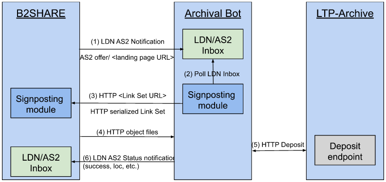

DICE Digital Preservation Service (DDPS)
========================================

!!! warning "Living Document (WIP)"

    This document is currently **under development**, which means **"Work in Progress"**.  
    It is carried out in the context of the [DICE project]{target="_blank"} (Data Infrastructure Capacities for EOSC), funded by the EU's Horizon 2020 project call H2020-INFRAEOSC-2018-2020 under Grant Agreement no. 101017207.

Introduction
------------
This website documents the functional requirements and specifications for the DICE Digital Preservation Service (DDPS).  
The documentation is meant as a guide on how to implement a Long-term Preservation Service between a short to midterm data (web) repository systems and a long-term preservation (LTP) Archive.  
The implementation adheres to documented community conventions for the use of W3C Linked Data Notifications (LDN) and Activity Streams 2 (AS2) to integrate repository systems with long-term (LTP) archives, in a distributed, resilient and web-native architecture.  
The standards used, and the application profiles documented here, are implementations of the generic patterns described by [Event Notifications in Value-Adding Networks]{target=_blank}, that details a profile for using Linked Data Notifications [LDN] with ActivityStreams2 [AS2] payloads in value-adding networks.  
Within this documentation, the Linked Data Notifications [LDN] with ActivityStreams2 [AS2] payloads will be reffered to as: `LDN+AS2 notifications`.

DICE Digital Preservation Service
---------------------------------

Interactions among Nodes are necessarily asynchronous because certain notification patterns do not require a response ("fire and forget") and, in patterns that do, such as requesting an action, the time between a request and the announcement of the Action Result is unpredictable.  

### Web Standards
It will focus on the following Web standards:
#### [Linked Data Notification](https://www.w3.org/TR/ldn/){target=_blank} (W3C) => Notification protocol
#### [Activity Streams 2](https://www.w3.org/TR/activitystreams-core/){target=_blank} (W3C) => [Vocabulary](https://www.w3.org/TR/activitystreams-vocabulary){target=_blank} / Contents (payload)
#### [Signposting]{target=_blank} => Navigational

### Namespaces
Within this document, the following namespace prefix bindings are used:

| Prefix 	 | Namespace                              | Name                                      |
|:---------|:---------------------------------------|:------------------------------------------|
| `as`     | https://www.w3.org/ns/activitystreams# | W3C ActivityStreams 2.0                   |
| `ldp`    | http://www.w3.org/ns/ldp#              | W3C Linked Data Platform (LDP) Vocabulary |
| `ddps`   | http://some.example.org/ns/ddps#       | DICE Digital Preservation Service         |
| `so`     | https://schema.org/                    | Schema.org                                |

Our examples LDN+AS2 payloads we use [JSON-LD] as syntax, in which we don’t explicitly write the prefixes.
*In the @context element in JSON-LD, one can define a mapping from the terms to [URI]-s, like done in Fig1*

[//]: # ([DICE Digital Preservation Service Technical Requirements]&#40;tech-requirements.md&#41; )

This document gives an overview of the DICE Digital Preservation Service (DDPS) architecture. The schema below displays all the components of the service and how they relate and interact to
each other. The notation used is not a formal one and is intended to be self-explanatory.

1. An LTP request will be sent from a B2SHARE landing page to the Archival Bot’s inbox, conveying the URL of the landing page of the dataset.
2. The Archival Bot will poll the LDN Inbox for such requests.
3. The Archival bot visits the landing page URL, discovers a Link Set provided via Signposting, and retrieves it.
4. The Archival Bot parses the Link Set to obtain URLs for object files and metadata, and then retrieves those.
5. The Archival Bot deposits an archival package containing metadata and object files to the LTP-archive.
6. The Archival Bot reports back on the status of the deposit.

Actors
------

* **Repository User** - an authenticated user of the repository system, typically a researcher who curates or deposits data.

Components
----------
Please see the [Service components](components.md) for further details.

Acknowledgements
----------------
This documentation for long-term-archiving notifications is carried out in the context of the [DICE project]{target="_blank"} (Data Infrastructure Capacities for EOSC), funded by the EU's Horizon 2020 project call H2020-INFRAEOSC-2018-2020 under Grant Agreement no. 101017207.  
It is developed by Task 4.3: "Long Term Preservation", as part of the working package 4 (WP4): "Integration with other services & platforms", and published in the joint WP4 Deliverable: "D4.3 Final integration with other services & platforms".

[Signposting]: https://www.signposting.org/
[DICE project]: {{ hyperlink.ext.dice }}
[Event Notifications in Value-Adding Networks]: https://www.eventnotifications.net/
